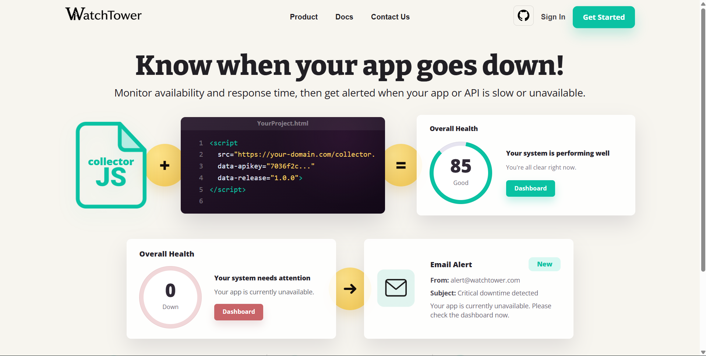
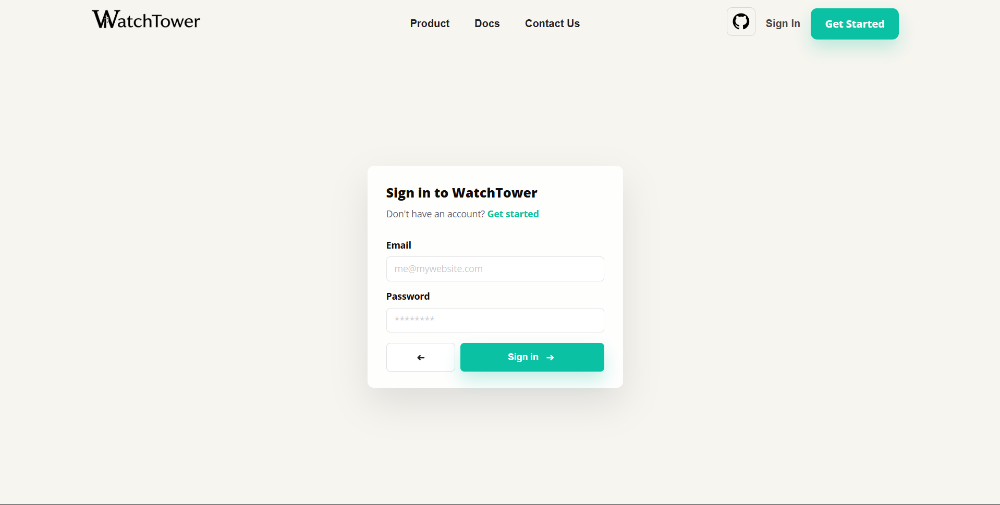
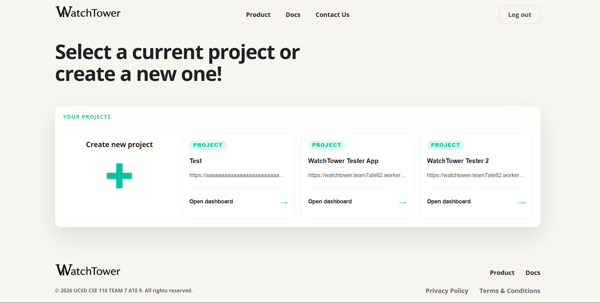
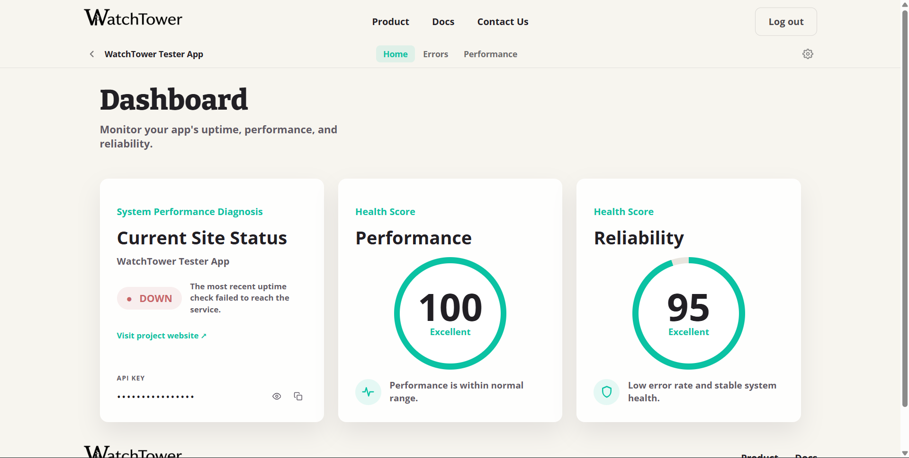
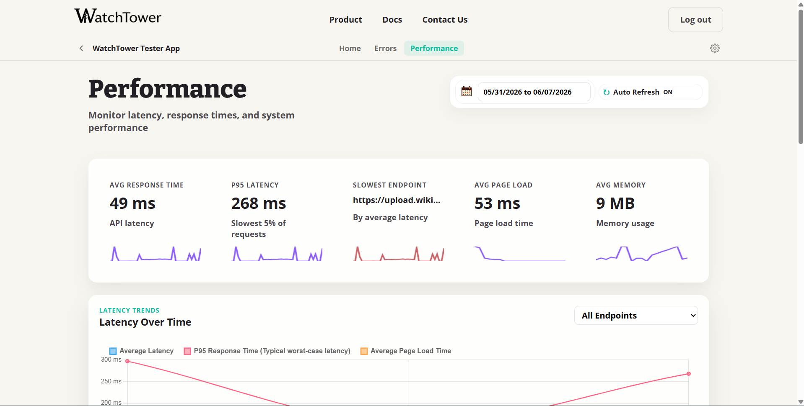
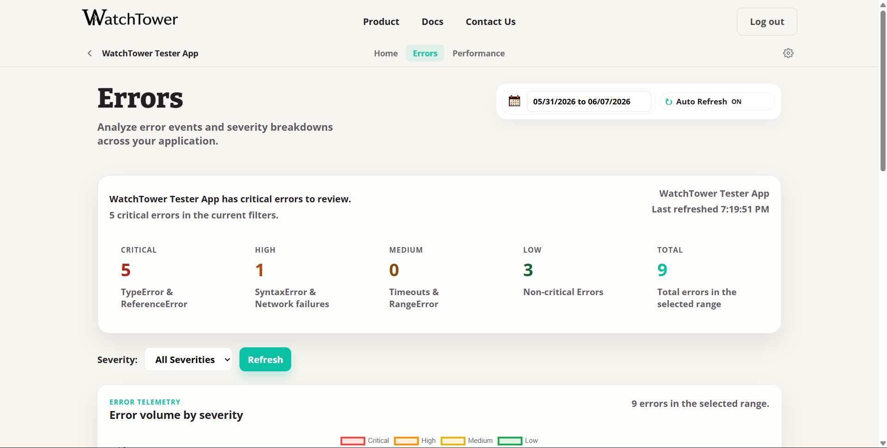

# WatchTower
1
WatchTower is a web application that lets developers monitor the uptime and performance of their web apps. Users register their apps, and WatchTower continuously polls them, surfacing downtime events, performance metrics, and sending email alerts when an app goes down. 

> Prefer a nicer reading experience? [View these docs on the GitHub Pages site.](https://cse110-sp26-group08.github.io/WatchTower/)
>
> Looking for the API reference? [View the REST API docs.](documentation/rest-api.md)
>
> Looking for the project wiki? [View the GitHub wiki.](https://github.com/cse110-sp26-group08/WatchTower/wiki)

> The deployed version of our website: [https://watchtower.team7ate92.workers.dev](https://watchtower.team7ate92.workers.dev)
>
> Watch the Public Final Video [Here](https://youtu.be/zy2QQ2NDx3U)
---

## Table of Contents

- [WatchTower](#watchtower)
  - [Table of Contents](#table-of-contents)
  - [Repo Structure](#repo-structure)
  - [How to Run the Project](#how-to-run-the-project)
    - [1. Install Dependencies](#1-install-dependencies)
    - [2. Download Environment Files](#2-download-environment-files)
    - [3. Start the App](#3-start-the-app)
  - [Using WatchTower](#using-watchtower)
    - [1. Create an Account and Register Your App](#1-create-an-account-and-register-your-app)
    - [2. Add the Collector to Your Project](#2-add-the-collector-to-your-project)
  - [Screenshots](#screenshots)

---

## Repo Structure

```text
WatchTower/
|-- backend/                  # Node.js / Express server
|   |-- app.js                # Server entry point
|   |-- controllers/          # Business logic (users, apps, events)
|   |-- endpoints/            # Express route handlers
|   |-- schema/               # Drizzle ORM table definitions
|   |-- util/                 # Shared utilities (DB, email, downtime, IDs)
|   |-- migrations/           # Drizzle database migrations
|   |-- tests/                # Jest integration and controller tests
|   |-- drizzle.config.js     # Drizzle migration configuration
|   `-- package.json          # Backend scripts and dependencies
|-- frontend/
|   |-- webpages/             # App pages (homepage, login, signup, dashboard, apps, docs, metrics, settings)
|   |-- js/                   # Client-side scripts and web components
|   |-- styling/              # CSS stylesheets
|   |-- templates/            # Reusable HTML templates
|   `-- assets/               # Icons and static images
|-- documentation/            # REST API reference and backend utility docs
|-- planning/                 # Planning docs, ADRs, research, and design artifacts
|   |-- architecture_decisions/
|   |-- frontend_design/
|   |-- project_planning/
|   `-- stakeholder_interview/
|-- retrospectives/           # Sprint retrospective summaries
|-- collector.js              # Client-side monitoring script for external apps
|-- index.html                # Marketing / landing page entry file at repo root
`-- package.json              # Root scripts for installing and starting the project
```

---

## How to Run the Project

### 1. Install Dependencies

From the `WatchTower/` directory, install backend dependencies:

```bash
npm install --prefix backend
```

### 2. Download Environment Files

The current project uses a SQL-based (PostgreSQL) database via Drizzle ORM.

Obtain the appropriate environment files from the project team and place them inside `backend/`.

This setup requires two files:

```text
WatchTower/
`-- backend/
    |-- .env        <- place here
    `-- .env.test   <- place here
```

Both files follow this structure:

```text
DATABASE_URL=<your-postgres-connection-string>
PORT=3000
SENDGRID_API_KEY=<your-sendgrid-api-key>
SENDGRID_FROM=<your-verified-sender-email>
```

> Do not commit these files, they are already listed in `.gitignore`.

### 3. Start the App

From the `WatchTower/` directory:

```bash
npm start
```

This runs any pending database migrations and then starts the Express server. Open your browser and navigate to:

```text
http://localhost:3000
```

---

## Using WatchTower

### 1. Create an Account and Register Your App

1. Open WatchTower in your browser (`http://localhost:3000`).
2. Sign up for an account and log in.
3. Navigate to the **App Selection** page and register your app by giving it a name and (optionally) a URL to monitor for uptime.
4. After the app is created, WatchTower generates a unique **API key** for it. Copy this key, you will need it in the next step.

> WatchTower automatically polls your app's URL every 5 minutes to check if it is reachable and will alert you by email if it goes down.

---

### 2. Add the Collector to Your Project

The collector is a single JavaScript file (`collector.js`) that you drop into any web app. It automatically tracks:

- **JavaScript errors** unhandled exceptions and promise rejections, with severity classification
- **Page performance** load time, DOM content loaded time, time to first byte (TTFB), and JS memory usage
- **API latency** intercepts all `fetch()` calls and records how long each one takes

**Step 1 - Download `collector.js` from the live site**

Download `collector.js` from the [WatchTower docs page](https://watchtower.team7ate92.workers.dev) and place it somewhere your HTML can reach, for example:

```text
your-project/
`-- scripts/
    `-- collector.js
```

**Step 2 - Add a single `<script>` tag**

Paste the following into the `<head>` or end of `<body>` of each HTML page you want to monitor. Replace the placeholder values with your own:

```html
<script
  id="collector-script"
  src="/scripts/collector.js"
  data-apikey="YOUR_API_KEY"
  data-release="1.0.0">
</script>
```

| Attribute | Description |
|---|---|
| `data-apikey` | The API key generated by WatchTower when you registered your app |
| `data-release` | A version string for this deployment (e.g. `"1.0.0"` or a git SHA) used to correlate errors to a specific release |

That's it, no build step or package install required. Once the script is on the page, all errors and performance data are sent to WatchTower automatically.

<details>
<summary><strong>Running WatchTower on a different host or port?</strong></summary>
<br>

By default `collector.js` sends events to `http://localhost:3000`. If your WatchTower instance is hosted elsewhere, open `collector.js` and update the `baseUrl` on line 17:

```js
const baseUrl = "https://your-watchtower-host.com";
```

</details>

---

## Screenshots

**Landing Page**


**Sign Up / Login**


**App Selection**


**App Dashboard**


**Performance View**


**Error Tracking**

